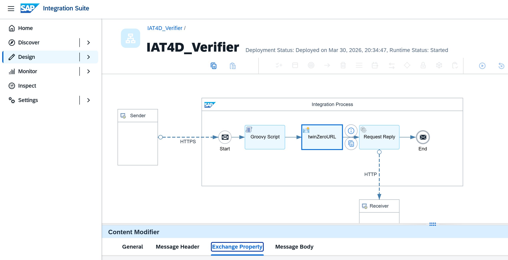

# Signature Verification for SAP Cloud Integrations (CPI)

This repository provides a production-ready Groovy script and JSON payload
contract for verifying Ed25519 signatures inside SAP Cloud Integration (CPI).
It enables SAP partners to securely validate mobile-originated payloads using
the IAT4D trust model.

## Architecture

## JSON Payload Contract
See `src/examples/sample-payload.json`

## Groovy Script
The script is located in
`src/groovy/IAT4D_Verify.groovy` Paste it directly into a Script step of your CPI iFlow.

## Secure Store Setup
In SAP Integration Suite `Monitor` section create a `Secure Parameter` named
`IAT4D_SECRET_VERIFY_KEY`

The parameter field must contain your individual Base64-encoded verification key.

## How Verification Works
The IAT4D signs the string concatenation
`guid + name + time`

The CPI script reconstructs this string and verifies the signature.

In SAP `name` serves as the unique identifier for an iMark (location/site). We operate a public
digital twin (twinZero above) that enriches these identifiers with human-friendly descriptions
intended for showing instantly, when a user taps an iMark with their mobile device.

## Testing
Use the sample payload in
`src/examples/sample-payload.json`

Matching `IAT4D_SECRET_VERIFY_KEY` = `tZ1jn8GuySjYxJ3JOwM9jZBB2JY4xkSjZYq/A43kDY8=`

`POST` the payload with your chosen SAP authentication to a configured endpoint.

`groovyTest.zip` contains the iFlow example depicted above.

## Support
Integration support and partnership inquiries -

Contact us at [info@iat4d.com](mailto:info@iat4d.com) or visit [https://iat4d.com](https://iat4d.com)

